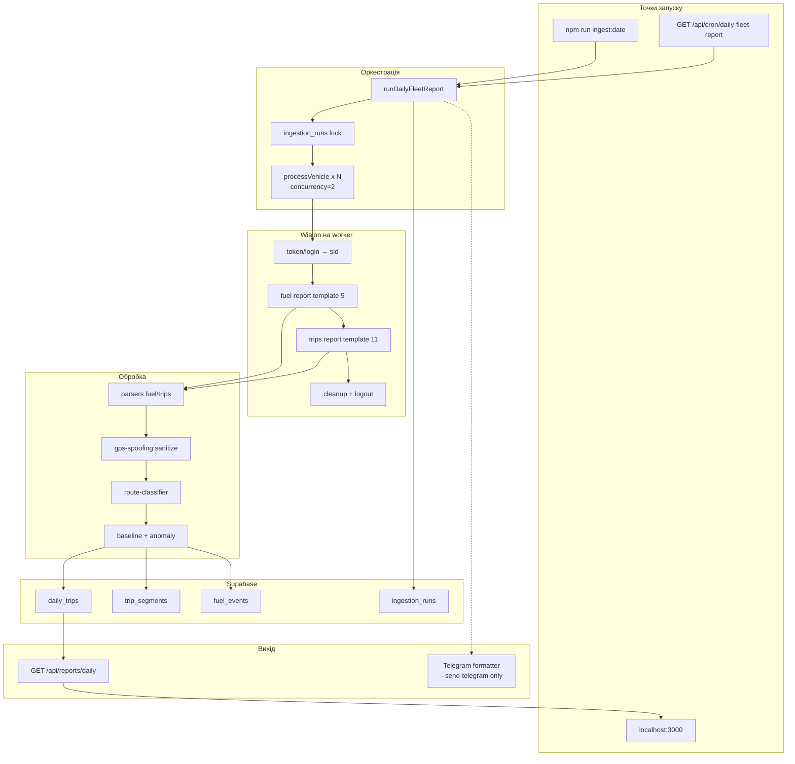

# Fleet Analytics — звіт для ШІ-агентів

Документ описує поточний стан проєкту, архітектуру, відомі підводні камені та робочий процес.  
Оновлено: 2026-06-16.

## Мета проєкту

Щоденний збір даних флоту з **Moniterra/Wialon**, нормалізація в **Supabase**, детекція аномалій палива, локальний перегляд і (опційно) звіт у **Telegram**.

Флот: **24 активні ТЗ**, бізнес-день у timezone `Europe/Kyiv`.

---

## Останні зміни (зріз перед новими правками)

- Розширено ingestion і дашборд: добові метрики руху/стоянок із `.Поездки` stats + rolling розхід ~1000 км (див. `07-fleet-analytics-report.md`, міграція `supabase/migrations/003_daily_trips_fleet_metrics.sql`).
- Оновлено UI: покращено стилі та UX логіну/помилок; актуалізовано вигляд локального дашборду (останній коміт: “Enhance login UI…”).

---

## Стек

| Шар | Технологія |
|-----|------------|
| Runtime | Node.js, Next.js 15 App Router |
| Мова | TypeScript (strict) |
| БД | Supabase (PostgreSQL) |
| Зовнішні API | Wialon Remote API, Telegram Bot API |
| Дати | Luxon |
| Валідація env | Zod |
| Тести | Vitest (55 тестів) |

---

## Архітектура (end-to-end)



---

## Структура репозиторію

```text
anal/
├── src/
│   ├── app/                    # Next.js routes
│   │   ├── page.tsx            # Локальний дашборд перегляду БД
│   │   └── api/
│   │       ├── health/
│   │       ├── cron/daily-fleet-report/
│   │       └── reports/daily/  # JSON звіт за дату
│   ├── jobs/
│   │   ├── run-daily-fleet-report.ts   # Головний job
│   │   └── process-vehicle.ts          # 1 ТЗ: fuel + trips → DB
│   ├── wialon/
│   │   ├── client.ts           # HTTP клієнт, retry
│   │   ├── report-runner.ts    # lifecycle звіту + polling
│   │   ├── normalize-report.ts # нормалізація live API відповідей
│   │   └── parsers/            # fuel, trips, fuel-events
│   ├── analytics/
│   │   ├── route-classifier.ts
│   │   ├── gps-spoofing.ts     # детекція GPS-спуфінгу (Peru тощо)
│   │   ├── baseline.ts, anomaly.ts
│   │   ├── fleet-summary.ts
│   │   └── vehicle-day-window.ts
│   ├── db/                     # Supabase repos
│   ├── telegram/               # formatter + client (HTML chunks)
│   └── config/env.ts
├── scripts/
│   ├── run-daily.ts            # CLI ingest
│   ├── wialon-probe.ts         # діагностика токена/звітів
│   └── test-integrations.ts
├── supabase/migrations/
│   ├── 001_initial_schema.sql
│   ├── 002_trip_segments_metrics.sql
│   └── 003_daily_trips_fleet_metrics.sql
├── tests/                      # unit + integration + fixtures
├── AGENTS.md                   # правила відповіді користувачу (UA)
└── README.md                   # setup/deploy
```

---

## Пайплайн обробки одного ТЗ

Файл: `src/jobs/process-vehicle.ts`

1. `token/login` → окремий `sid` на worker.
2. **Fuel report** (template `5`) за бізнес-день → stats + опційно chronology.
3. **Trips report** (template `11`) → rows сегментів поїздок.
4. Парсинг → `sanitizeTripSegmentsForGpsSpoofing()` → `classifyRoute()`.
5. Baseline з історії `daily_trips` → `evaluateFuelAnomaly()`.
6. Upsert у `daily_trips` + `trip_segments` + `fuel_events`.
7. `cleanup_result` + `logout`.

Ключ `(vehicle_id, report_date)` — ідемпотентний upsert.

---

## База даних (Supabase)

### Таблиці

| Таблиця | Призначення |
|---------|-------------|
| `vehicles` | Довідник ТЗ (wialon_unit_id, display_name) |
| `daily_trips` | 1 рядок / авто / день: пробіг, паливо, маршрут, baseline, anomaly |
| `trip_segments` | Сегменти з trips-report: час, адреси, км, паливо |
| `fuel_events` | Заправки/зливи з fuel chronology |
| `ingestion_runs` | Lock + статус job за `report_date` |

### Перевірка даних (SQL)

```sql
select count(*) from daily_trips where report_date = '2026-06-14';
select count(*) from trip_segments ts
  join daily_trips dt on dt.id = ts.daily_trip_id
  where dt.report_date = '2026-06-14';
```

Еталонний успішний run (2026-06-14): **24** daily_trips, **51** segments, **~13** з маршрутом після GPS-spoof fix.

---

## Wialon — критичні нюанси

### Авторизація

- API використовує **лише** `WIALON_TOKEN` (72 символи), `token/login`.
- `WIALON_USER` / `WIALON_PASSWORD` — **не для API**, лише довідково.
- `WIALON_OPERATE_AS` — лише якщо токен підтримує impersonation (у brokinvest не потрібен).
- Токен має бути від акаунта з доступом до **24 units** на resource `2217` (brokinvest), не `brokinvest_api`.

Діагностика: `npm run wialon:probe`

### Lifecycle звіту

```text
exec_report → get_report_status (poll до status=4) → apply_report_result
→ select_result_rows → cleanup_result → logout
```

- **1 sid = 1 активний звіт**; не паралелити звіти на одному sid.
- `get_report_status` повертає `status: "4"` як **рядок** — обов'язково `Number(status)`.
- Default: `WIALON_CONCURRENCY=2`, `WIALON_REPORT_TIMEOUT_MS=180000`.

### Формат live API ≠ fixtures

Live Moniterra відповідає інакше, ніж JSON-фікстури в `tests/fixtures/`:

| Поле | Fixtures | Live API |
|------|----------|----------|
| `stats` | `{ n, c: [...] }` | `[["label", "value"], ...]` |
| `select_result_rows` | `{ rows: [...] }` | масив рядків напряму |

Нормалізація: `src/wialon/normalize-report.ts` (викликається з `report-runner.ts`).

### Адреси та маршрути

- Європейський формат: `7587GA de Lutte, Netherlands, Overijssel, A1`
- Український формат: `Нікополь 53201, Україна, ...` або `Україна, ... обл., ...`
- Парсинг країни/міста: `src/analytics/country-normalizer.ts`
- `route_key` формат: `NL:DE_LUTTE>BE:OOSTENDE` або `UA:НІКОПОЛЬ>UA:РЕШЕТИЛІВКА`
- `slugifyCity` підтримує кирилицю в route_key.

---

## GPS-спуфінг

Файл: `src/analytics/gps-spoofing.ts`

У Україні GPS інколи показує чужі країни (напр. **Lima, Peru**).  
Логіка:

1. Якщо ≥2 endpoints у plausible країнах (UA/EU), а endpoint у «дивній» країні (PE…) → **спуфінг**.
2. Замінити на найближче відоме місто з anchor-країни (зазвичай UA).
3. Нормалізувати назви: `Нікополь 53201` → `Нікополь`, `1.24 km from Решетилівка` → `Решетилівка`.

Попередження пишуться в `warnings` ingestion (не в Telegram, якщо не надсилати).

---

## Telegram

Файл: `src/telegram/formatter.ts`

- Формат **українською**: Підсумок + список Автомобілів (маршрут, час, пробіг, паливо, розхід).
- Аномалії: 🔴 / ⚠️ inline.
- Chunking ~3500 символів.

**Поточний режим роботи (станом на 2026-06-15):** Telegram **не надсилати** під час валідації.  
Запуск з Telegram лише явно:

```bash
npm run ingest:date -- --date=YYYY-MM-DD --force --send-telegram
```

Cron (`/api/cron/daily-fleet-report`) надсилає Telegram автоматично в prod.

---

## Локальний фронтенд (перевірка даних)

```bash
npm run dev
```

- UI: http://localhost:3000
- API: `GET /api/reports/daily?date=2026-06-14`
- Показує `daily_trips` + `trip_segments` з Supabase
- Кнопка «Деталі» — сегменти поїздок

**Не плутати** з Telegram — це read-only перегляд БД.

---

## Команди

```bash
npm install
cp .env.example .env          # заповнити секрети локально, не комітити

npm run dev                   # локальний перегляд
npm test                      # 38 тестів
npm run build
npm run integrations:test     # Supabase + Wialon login
npm run wialon:probe          # діагностика токена/звітів

# Ingest (основний робочий цикл)
npm run ingest:date -- --date=2026-06-14
npm run ingest:date -- --date=2026-06-14 --force   # перезапис існуючого run
```

---

## Ingestion lock

`src/db/ingestion-runs-repository.ts`

- Унікальний `(job_name, report_date)`.
- `completed` без `--force` → skip.
- `running` зі свіжим heartbeat → skip (stale після 15 хв).
- **Немає** auto-kill паралельних процесів на машині — не запускати два ingest одночасно.

---

## Аналітика

| Модуль | Що робить |
|--------|-----------|
| `baseline.ts` | Динамічний baseline розходу по route_key / route_tag |
| `anomaly.ts` | warning/critical vs baseline |
| `route-classifier.ts` | route_key, route_tag, local maneuvers (<2 km) |
| `fleet-summary.ts` | Агрегація для Telegram |

Поля `anomaly_status`: `not_evaluated`, `insufficient_history`, `normal`, `warning`, `critical`.

---

## Тести та фікстури

- `tests/fixtures/fuel-report-6221-2026-06-14.json` — object stats (legacy формат)
- `tests/fixtures/trips-report-6221-2026-06-14.json`
- `tests/unit/normalize-report.test.ts` — tuple stats + array rows
- `tests/unit/gps-spoofing.test.ts` — Peru → UA
- `tests/integration/wialon-lifecycle.test.ts` — polling, cleanup, string status `"4"`

При зміні парсерів — оновлювати fixtures **і** перевіряти live через `wialon-probe` / одноразовий tsx-скрипт.

---

## Відомі обмеження

| Тема | Статус |
|------|--------|
| Водії в trips-report | Немає (поля в schema зарезервовані) |
| Geofences report | Не використовується |
| 0 km + трохи палива | Нормально — стоянка, ДУТ без поїздок |
| 0 km, 0 сегментів | Машина не їздила |
| `UA:1_26_KM_FROM_...` route keys | Технічні фрагменти адреси; можна покращити city parser |
| Vercel 300s | 24 ТЗ ~27s локально; на Vercel потрібен Pro + maxDuration |
| `send:telegram` без re-ingest | Не реалізовано (планувалось окремо) |
| Duplicate process guard | Не реалізовано (file lock / PID) |

---

## Правила для агентів

З `AGENTS.md`:

- Відповідати користувачу **українською**, коротко.
- **Ніколи** не писати токени, ключі, `sid`, cookies у файли/коміти.
- Не комітити без явного запиту.
- Telegram не вмикати без запиту під час фази валідації.

---

## Типовий workflow агента

1. `npm run wialon:probe` — якщо проблеми з Wialon.
2. `npm run ingest:date -- --date=YYYY-MM-DD --force` — оновити БД.
3. `npm run dev` → перевірити http://localhost:3000.
4. `npm test` + `npm run build` — перед PR.
5. Telegram — лише коли користувач явно просить.

---

## Еталонні метрики (2026-06-14, після фіксів)

| Метрика | Значення |
|---------|----------|
| processed | 24/24 |
| total mileage | ~2771 km |
| total fuel | ~924 l |
| with segments | 13 |
| with route | 12–13 (після GPS-spoof fix для AA8670XC) |
| ingest duration | ~27 s локально |

---

## Що робити далі (backlog)

- [ ] `npm run send:telegram -- --date=...` без re-ingest (read from DB)
- [ ] Покращити `extractCityFromAddress` для UA адрес (менше `km from`)
- [ ] File lock / cooperative abort для паралельних ingest
- [ ] Anomaly badges на локальному фронті
- [ ] Фільтри UI: без маршруту, 0 km, anomalies
- [ ] Vercel cron у prod після стабілізації формату

---

## Корисні файли специфікації

У корені також є документи планування (не завжди синхронізовані з кодом):

- `06-code-generation-super-prompt.md` — оригінальна специфікація MVP
- `02-integration-id-registry.md` — ID шаблонів Wialon

**Джерело правди — код і цей файл**, не застарілі промпти.
